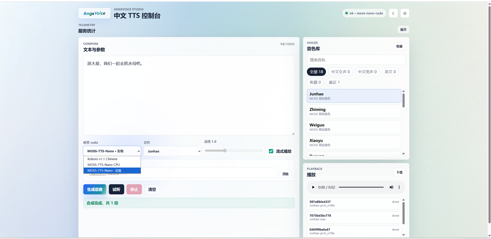
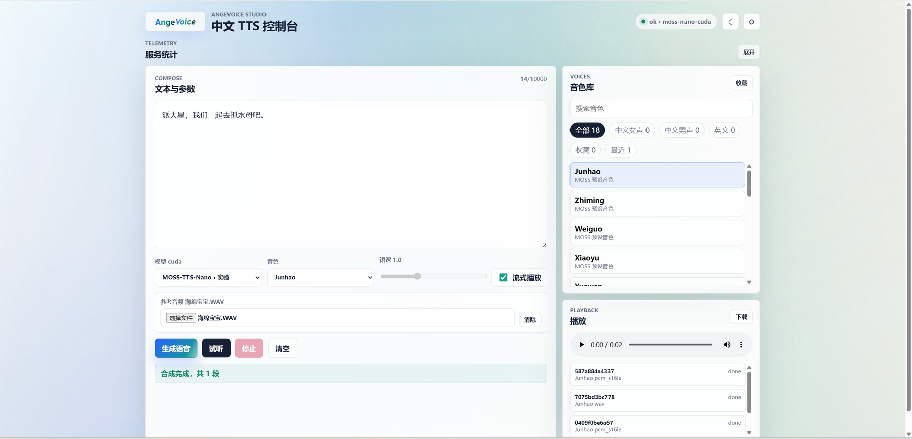

# AngeVoice

> 轻量级中文 TTS 自托管服务。默认使用 Kokoro v1.1 中文模型，可按需切换 MOSS-TTS-Nano；提供 OpenAI 兼容 API、WebSocket 流式、Studio Web UI、MOSS 参考音频克隆、批量合成、缓存、统计和 Docker CPU/GPU/老显卡部署。

[English](README_EN.md) | 中文

[](https://github.com/ang77712829/AngeVoice/actions/workflows/ci.yml)
[](https://www.python.org/downloads/)
[](LICENSE)


## 一键安装（推荐普通用户）

服务器已安装 Docker 和 Docker Compose V2 后，可直接运行交互式安装脚本。脚本会自动检测 CPU/GPU、老架构 NVIDIA 显卡、Docker/Compose、GitHub、GHCR、Docker Hub 与本机 Docker registry mirror，并推荐 `cpu` / `gpu` / `legacy-gpu` 画像。

```bash
bash <(curl -fsSL https://raw.githubusercontent.com/ang77712829/AngeVoice/main/scripts/install.sh)
```

如果你在国内网络访问 GitHub 或 GHCR 较慢，可以先下载源码包后执行本地脚本：

```bash
git clone https://github.com/ang77712829/AngeVoice.git
cd AngeVoice
bash scripts/install.sh
```

默认 Docker 配置集中在 `docker/angevoice.env`，CPU/NAS 场景开箱安全；GPU 和 legacy-gpu 画像只覆盖必要的 CUDA 参数。

脚本在源码目录内运行时会**就地安装/更新**，不会再额外克隆到 `/opt/angevoice`，更适合 NAS 文件管理。远程 `curl` 方式没有本地项目目录时才会使用 `/opt/angevoice`。安装完成后会自动读取本机局域网 IP，输出完整访问地址，例如 `http://192.168.1.10:8101`。

安装完成后脚本会创建 `AngeVoice` 管理命令。以后直接输入：

```bash
AngeVoice
```

即可打开菜单，执行安装/更新、重启、停止、卸载、查看状态和访问地址。也可以直接执行：

```bash
bash scripts/install.sh --status
bash scripts/install.sh --restart
bash scripts/install.sh --stop
bash scripts/install.sh --uninstall
```

卸载只停止并移除容器/网络，不删除模型、输出和配置文件。


## 小智 ESP32 后端适配

本仓库新增 `xiaozhi/` 目录，提供小智后端无侵入适配包：

- `xiaozhi/adapters/angevoice.py`：OpenAI 兼容非流式适配，最快跑通。
- `xiaozhi/adapters/angevoice_stream.py`：WebSocket 流式适配，支持 Kokoro/MOSS 流式输出。
- `xiaozhi/adapters/angevoice_clone.py`：MOSS 参考音频克隆非流式适配。
- `xiaozhi/scripts/install-xiaozhi-adapter.sh`：一键安装适配器、patch 小智 Compose、写入示例配置。
- `xiaozhi/manager/presets.yaml`：智控台可复制预设，不修改小智前端源码。

一键接入小智：

```bash
cd /path/to/xiaozhi-server
bash <(curl -fsSL https://raw.githubusercontent.com/ang77712829/AngeVoice/main/xiaozhi/scripts/install-xiaozhi-adapter.sh)
```

MOSS 克隆流式示例：

```bash
bash <(curl -fsSL https://raw.githubusercontent.com/ang77712829/AngeVoice/main/xiaozhi/scripts/install-xiaozhi-adapter.sh) \
  --mode moss-clone-stream \
  --prompt-audio ./reference.wav
```

完整教程见 [`xiaozhi/README.md`](xiaozhi/README.md)。

## 项目定位

AngeVoice 不是重新训练的新模型，而是面向低配设备、NAS 和长期运行环境做的本地 TTS 服务框架。

适合：

- 本地/NAS/家用服务器中文语音合成服务
- Agent、阅读器、有声书、配音工具的 TTS 后端
- OpenAI 兼容 TTS API 后端
- 需要逐段播放、停止生成、批量导出 ZIP 的 Web 应用
- CPU、NVIDIA GPU、老架构 GPU（如 Tesla P4）/ 保守 CUDA 环境

> 模型来源：默认引擎基于 Kokoro v1.1 / Kokoro-82M 中文模型；MOSS-TTS-Nano 集成使用 OpenMOSS 官方运行时代码。模型版权、许可证与限制请以上游仓库为准。

## Studio 预览





## 核心能力

| 能力 | 说明 |
|---|---|
| Studio Web UI | 内置控制台，支持模型切换、音色筛选、试听、流式播放、停止生成、API Key 设置和统计卡片 |
| API 文档页 | `GET /api-docs` 提供可复制调用示例，重点覆盖 MOSS 参考音频克隆和流式克隆 |
| OpenAI 兼容 API | `POST /v1/audio/speech`，兼容 `model/input/voice/speed/response_format` |
| MOSS-TTS-Nano | 通过 OpenMOSS 官方 ONNX runtime 接入，支持预设音色、参考音频克隆、CPU 基线和 CUDA 实验模式；默认关闭进程级隔离，优先保证 NAS/老显卡的实时流式体验，必要时可手动开启硬隔离 |
| 多模型运行时 | `/v1/models` 查看、加载、卸载和切换模型；可切换时卸载旧模型并隔离缓存 |
| WebSocket 流式 | `WS /ws/v1/tts` 小包推送；支持 `cancel` / `stop`；MOSS 克隆可在首包传参考音频 base64 |
| 中文文本规则 | 自动断句标点、jieba 分词优先、兜底词典、常见多音字上下文修正 |
| 批量合成 | `POST /v1/audio/batch` 返回 ZIP 和 `manifest.json` |
| 服务治理 | 请求 ID、`/health`、`/stats`、`/requests`、超时、并发限制、LRU 缓存 |
| Docker 画像 | CPU、GPU、老架构 GPU 三套 Compose 画像 |
| CLI | 推荐 `angevoice`，旧命令 `kokoro-tts` 继续兼容 |
| 空闲超时释放显存 | 默认 10 分钟无人使用后卸载所有已加载模型（包括当前模型），释放显存/内存并降低 NAS 功耗 |

## 快速开始

### Docker GPU

```bash
git clone https://github.com/ang77712829/AngeVoice.git
cd AngeVoice/docker/gpu
sudo docker compose up -d
```

默认访问：

```text
http://localhost:8101
```

检查服务：

```bash
curl http://127.0.0.1:8101/health
curl http://127.0.0.1:8101/v1/models
```

> **容器健康状态**：每个 Docker 镜像内置 `HEALTHCHECK`，每 30 秒自动请求 `/health` 端点。返回 `{"status":"ok"}` 或 `{"status":"idle"}` 都判定为 healthy；`idle` 表示模型已被空闲卸载但服务正常可用。`start-period=60s` 确保模型加载期间不会误判。可用 `docker inspect --format='{{json .State.Health}}' <container>` 查看。

### Docker CPU / 老架构 GPU

```bash
# CPU，默认端口 8100
cd docker/cpu && sudo docker compose up -d

# 老架构 GPU，默认端口 8102
cd docker/legacy-gpu && sudo docker compose up -d
```

### pip 开发安装

```bash
git clone https://github.com/ang77712829/AngeVoice.git
cd AngeVoice
pip install -e .

angevoice serve --port 8000
angevoice synth "你好世界" -o hello.wav -v zm_010

# 旧命令仍可用
kokoro-tts serve --port 8000
```


### `/health` 状态语义

`/health` 返回 HTTP 200 不代表当前模型一定常驻内存，需结合 `status` 字段：

| status | 含义 |
|---|---|
| `ok` | 服务正常，当前模型已加载 |
| `idle` | 服务正常，当前模型因空闲超时已卸载；下次请求会自动加载 |
| `loading` | 服务已启动但当前模型还未完成首次加载 |
| `degraded` | 至少有一个已加载模型 unhealthy |

Docker 健康检查把 `ok` 和 `idle` 都视为 healthy。

## 文档入口

| 入口 | 地址 | 用途 |
|---|---|---|
| Studio | `/` | 图形化合成、试听、模型切换 |
| API 文档页 | `/api-docs` | 普通用户复制 HTTP/WebSocket/MOSS 克隆示例 |
| Swagger | `/docs` | FastAPI 自动交互式调试文档 |
| ReDoc | `/redoc` | FastAPI 自动阅读型文档 |
| API Reference | [`docs/API_REFERENCE.md`](docs/API_REFERENCE.md) | 仓库内完整接口说明 |
| Troubleshooting | [`docs/TROUBLESHOOTING.md`](docs/TROUBLESHOOTING.md) | 常见部署和调用问题 |

## 端口和接口速览

| 部署方式 | HTTP / Web UI | WebSocket |
|---|---|---|
| pip / 开发运行 | `http://localhost:8000` | `ws://localhost:8000/ws/v1/tts` |
| Docker CPU | `http://localhost:8100` | `ws://localhost:8100/ws/v1/tts` |
| Docker GPU | `http://localhost:8101` | `ws://localhost:8101/ws/v1/tts` |
| Docker 老架构 GPU | `http://localhost:8102` | `ws://localhost:8102/ws/v1/tts` |

| 功能 | 调用 |
|---|---|
| 健康检查 / 统计 / 请求状态 | `GET /health`、`GET /stats`、`GET /requests` |
| 模型列表 / 当前模型 / 切换 | `GET /v1/models`、`GET /v1/models/current`、`POST /v1/models/switch` |
| 音色 / 格式 | `GET /v1/audio/voices`、`GET /v1/audio/formats` |
| OpenAI 兼容合成 | `POST /v1/audio/speech` |
| 旧版兼容合成 / MOSS 克隆上传 | `GET /api/tts`、`POST /api/tts` |
| WebSocket 流式 / MOSS 克隆流式 | `WS /ws/v1/tts` |
| 批量 ZIP | `POST /v1/audio/batch` |
| 取消请求 | `POST /v1/audio/requests/{request_id}/cancel` |

## 常用 API 示例

### OpenAI 兼容 TTS

```bash
BASE_URL=http://localhost:8000

curl -X POST "$BASE_URL/v1/audio/speech" \
  -H "Content-Type: application/json" \
  -d '{"model":"kokoro","input":"你好世界","voice":"zm_010","response_format":"wav"}' \
  --output output.wav
```

启用 `KOKORO_API_KEY` 后增加：

```bash
-H "Authorization: Bearer YOUR_TOKEN"
```

### MOSS 参考音频克隆

MOSS 克隆不是把音频放进 `models/voices`。`models/voices` 是 Kokoro `.pt` 音色目录。

最推荐的方式是请求时上传参考音频：

```bash
curl -X POST "$BASE_URL/api/tts" \
  -F model=moss-nano-cpu \
  -F text="这是参考音频克隆测试。" \
  -F voice=Junhao \
  -F response_format=wav \
  -F prompt_audio=@reference.wav \
  --output clone.wav
```

WebSocket 流式克隆时，参考音频放在首个 JSON 的 `prompt_audio.data`：

```json
{
  "model": "moss-nano-cpu",
  "text": "这是参考音频克隆的流式测试。",
  "voice": "Junhao",
  "format": "pcm_s16le",
  "prompt_audio": {
    "filename": "reference.wav",
    "data": "<base64-or-data-url>"
  }
}
```

完整的浏览器 FileReader、Python websockets、Docker 默认参考音频挂载示例见：

- [`/api-docs`](http://localhost:8000/api-docs)
- [`docs/API_REFERENCE.md`](docs/API_REFERENCE.md)

## 模型文件

首次运行时，如果本地没有完整模型文件，服务会自动从 Hugging Face 下载。离线部署或想提升冷启动速度，建议手动准备：

```bash
pip install huggingface_hub
huggingface-cli download hexgrad/Kokoro-82M-v1.1-zh \
  --local-dir models/ \
  --include "config.json" "kokoro-v1_1-zh.pth" "voices/*.pt"
```

至少需要：

```text
models/config.json
models/kokoro-v1_1-zh.pth
models/voices/*.pt
```

普通 `git clone` 可能只拿到 Git LFS 指针文件，不一定是真实模型文件。Docker Compose 已持久化 Hugging Face 缓存，避免容器重建后重复下载。

## Docker 持久化

| 宿主机目录 | 容器目录 | 用途 |
|---|---|---|
| `../../hf_cache` | `/root/.cache/huggingface` | Kokoro/Hugging Face 下载缓存 |
| `../../moss_models` | `/opt/MOSS-TTS-Nano/models` | MOSS ONNX 模型缓存 |
| `../../outputs` | `/app/outputs` | 开启 `ANGEVOICE_SAVE_OUTPUTS=true` 后保存 HTTP 合成结果 |

如需固定服务端默认 MOSS 参考音频，可额外挂载：

```yaml
volumes:
  - ../../prompts:/app/prompts:ro

environment:
  - MOSS_PROMPT_AUDIO_PATH=/app/prompts/reference.wav
```

## 关键配置

| 变量 | 默认值 | 说明 |
|---|---|---|
| `KOKORO_DEVICE` | `auto` | `auto` / `cpu` / `cuda` |
| `KOKORO_WORKERS` | `1` | Uvicorn worker 数；GPU 建议保持 1 |
| `KOKORO_MAX_CONCURRENT_REQUESTS` | `1` | 单进程最大合成并发 |
| `KOKORO_API_KEY` | - | 设置后启用 Bearer 鉴权；占位值会被拒绝 |
| `KOKORO_STREAM_CHUNK_SECONDS` | `0.50` | WebSocket 输出小包时长 |
| `KOKORO_CACHE_ENABLED` | `true` | 是否启用内存 LRU 缓存 |
| `KOKORO_BATCH_ENABLED` | `true` | 是否启用批量合成 |
| `KOKORO_ADMIN_ENABLED` | `false` | 是否启用管理后台和管理接口；开启后必须设置 `ANGEVOICE_ADMIN_PASSWORD` |
| `KOKORO_MP3_ENABLED` | `false` | 是否启用 MP3 输出，依赖 ffmpeg |
| `ANGEVOICE_ENABLED_MODELS` | `kokoro` | 启用的模型 ID，逗号分隔 |
| `ANGEVOICE_DEFAULT_MODEL` | `kokoro` | 启动时加载的默认模型 |
| `ANGEVOICE_MODEL_UNLOAD_ON_SWITCH` | `true` | 切换模型时卸载旧模型 |
| `ANGEVOICE_SAVE_OUTPUTS` | `false` | 是否保存 HTTP 合成结果 |
| `MOSS_MODEL_DIR` | - | MOSS ONNX 模型目录 |
| `MOSS_EXECUTION_PROVIDER` | `cpu` | MOSS ONNX provider：`cpu` / `cuda` |
| `MOSS_CUDA_ENABLED` | `true` | 是否允许注册/切换 `moss-nano-cuda` |
| `MOSS_PROMPT_UPLOAD_MAX_BYTES` | `20971520` | MOSS 克隆参考音频上传大小上限 |
| `MOSS_PROMPT_AUDIO_MAX_SECONDS` | `10` | 克隆参考音频裁剪时长 |
| `MOSS_PROMPT_CACHE_MAX_ITEMS` | `8` | 参考音频编码缓存条目数 |
| `MOSS_AUTO_FALLBACK_CPU` | `true` | CUDA 自检失败时回退 CPU |
| `MOSS_PROCESS_ISOLATION_ENABLED` | `false` | 是否启用 MOSS 进程级隔离；默认关闭以优先保证实时流式体验 |
| `MOSS_PROCESS_ISOLATION_PROVIDERS` | `cuda` | 哪些 provider 走隔离子进程，逗号分隔 |
| `MOSS_PROCESS_KILL_GRACE_SECONDS` | `2` | 超时后终止 worker 的宽限秒数 |
| `MOSS_QUALITY_GATE_ENABLED` | `true` | 拒绝静音、NaN/Inf 或明显 clipping 的 MOSS 自检输出 |
| `ANGEVOICE_IDLE_TIMEOUT_SECONDS` | `600` | 空闲超时自动卸载所有已加载模型（秒），0=禁用 |
| `ANGEVOICE_IDLE_CHECK_INTERVAL` | `30` | 空闲检查间隔（秒） |
| `MOSS_STREAM_BUDGET_THRESHOLD_LOW` | `0.25` | 音频播放余量低阈值（秒），低于此值每次解码 1 帧以尽快出声 |
| `MOSS_STREAM_BUDGET_THRESHOLD_MID` | `0.65` | 音频播放余量中阈值（秒），低于此值每次解码 2 帧 |
| `MOSS_STREAM_BUDGET_THRESHOLD_HIGH` | `1.20` | 音频播放余量高阈值（秒），低于此值每次解码 4 帧，高于此值每次解码 8 帧 |
| `MOSS_STREAM_CHUNK_MIN_FLOOR` | `0.10` | 流式最小分包时长下限（秒），避免过短碎片造成卡顿感 |

完整配置见 [`docs/API_REFERENCE.md`](docs/API_REFERENCE.md) 和各 Docker Compose 文件。

## 安全说明

- 公网部署建议设置 `KOKORO_API_KEY`，并在反向代理层限制来源。
- 管理后台/管理接口默认关闭；开启 `KOKORO_ADMIN_ENABLED=true` 时必须设置 `ANGEVOICE_ADMIN_PASSWORD`，账号和密码支持中文，公网部署还建议同时设置 `KOKORO_API_KEY` 并限制来源。
- `.pt` 音色上传默认关闭。只上传可信来源文件；PyTorch 权重文件不应来自不可信渠道。

⚠️ **安全警告**：公网环境**不建议**开启 `KOKORO_VOICE_UPLOAD_ENABLED`。
仅允许上传自己生成或完全可信来源的 `.pt` 文件。
如果必须开放，建议只在内网管理端使用，并配合反代 IP 白名单。
`.pt` 文件是 PyTorch 序列化格式，理论上可执行任意代码。
- 不建议把 `/admin/*` 直接暴露到公网。

详见 [`docs/SECURITY.md`](docs/SECURITY.md)。

## 已知限制

- AngeVoice 不是独立训练的新模型，音质、许可证和语言能力受上游模型影响。
- `moss-nano-cuda` 是实验模式；老显卡长期服务前建议充分试听确认无爆音、失真或 clipping。
- 长文本依赖分段合成，极长文本建议走批量/任务队列工作流。
- GPU 场景不建议多 worker 同时加载模型，容易造成显存占用翻倍。
- MP3 输出依赖 ffmpeg。
- WebSocket 是小包音频流，不是 token 级语音生成流。

## 测试

```bash
pip install -e '.[dev]'
pytest -q --cov=kokoro_tts --cov-report=term-missing
```

服务端到端测试（需服务已启动）：

```bash
# 完整端到端循环测试：health / voices / 合成 / websocket / cancel / 空闲卸载 / 压测
chmod +x scripts/e2e_loop_test.sh
./scripts/e2e_loop_test.sh http://127.0.0.1:8101              # 无认证，10轮
./scripts/e2e_loop_test.sh http://127.0.0.1:8101 my-key 50    # 带认证，50轮压测
```

轻量冒烟测试：

也可以在 GitHub Actions 手动触发 `Docker CPU Smoke` workflow，验证 `docker compose config --quiet`、CPU 镜像构建、容器启动、`/health` 和 `scripts/smoke_test.sh`。

```bash
chmod +x scripts/smoke_test.sh scripts/loop_test.sh
BASE_URL=http://127.0.0.1:8101 ./scripts/smoke_test.sh
N=50 BASE_URL=http://127.0.0.1:8101 ./scripts/loop_test.sh
```

## 更多文档

- [架构说明](docs/ARCHITECTURE.md)
- [API 参考](docs/API_REFERENCE.md)
- [安全说明](docs/SECURITY.md)
- [排障手册](docs/TROUBLESHOOTING.md)
- [服务画像](docs/SERVICE_PROFILES.md)
- [多模型运行时](docs/MODEL_RUNTIME.md)
- [v2.6 功能说明](docs/V2_5_FEATURES.md)
- [路线图](docs/ROADMAP.md)
- [老架构 GPU 部署说明](docker/legacy-gpu/README.md)

## License

MIT
